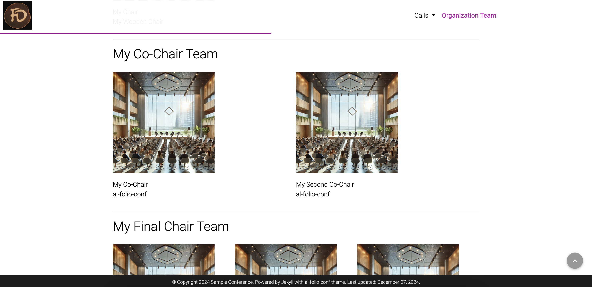

Archived, since not needed for conferences I'm involved anymore.

# al-folio-conf

**A simple, clean, and responsive [Jekyll](https://jekyllrb.com/) theme for conferences based on [al-folio](https://github.com/alshedivat/al-folio).**

## Getting started

Want to learn more about Jekyll? Check out [this tutorial](https://www.taniarascia.com/make-a-static-website-with-jekyll/). Why Jekyll? Read [Andrej Karpathy's blog post](https://karpathy.github.io/2014/07/01/switching-to-jekyll/)! Why write a blog? Read [Rachel Thomas blog post](https://medium.com/@racheltho/why-you-yes-you-should-blog-7d2544ac1045).

## Installing and Deploying

For installation and deployment details I refer to the original [al-folio Install.md](https://github.com/alshedivat/al-folio/blob/master/INSTALL.md)

## Customizing

For customization details please refer to [CUSTOMIZE.md](CUSTOMIZE.md).

## Features

### Important Dates

You can add important dates to the front page (layout: `conf`) and to pages of layout `call`:

### Organization Team

You can add a page with the organizational team (layout: `orga`):

## License

The theme is available as open source under the terms of the [MIT License](https://github.com/dfuchss/al-folio-conf/blob/master/LICENSE).

This theme is adapted from [al-folio](https://github.com/alshedivat/al-folio) by Maruan Al-Shedivat

Originally, **al-folio** was based on the [\*folio theme](https://github.com/bogoli/-folio) (published by [Lia Bogoev](https://liabogoev.com) and under the MIT license). Since then, it got a full re-write of the styles and many additional cool features.
